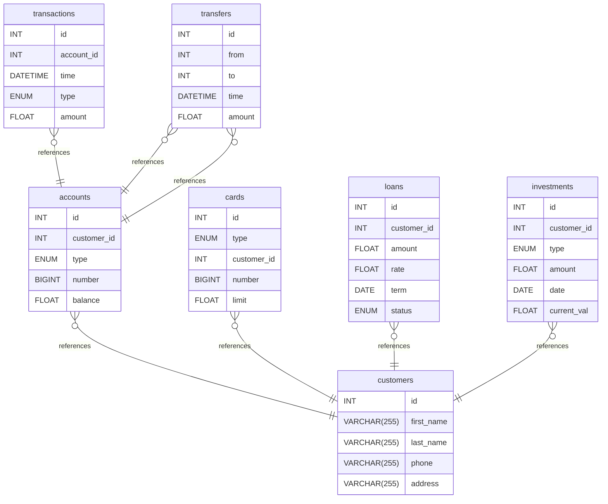

```mermaid
erDiagram
	accounts }o--|| customers : references
	cards }o--|| customers : references
	loans }o--|| customers : references
	investments }o--|| customers : references
	transactions }o--|| accounts : references
	transfers }o--|| accounts : references
	transfers }o--|| accounts : references

	accounts {
		INT id
		INT customer_id
		ENUM type
		BIGINT number
		FLOAT balance
	}

	customers {
		INT id
		VARCHAR(255) first_name
		VARCHAR(255) last_name
		VARCHAR(255) phone
		VARCHAR(255) address
	}

	transactions {
		INT id
		INT account_id
		DATETIME time
		ENUM type
		FLOAT amount
	}

	transfers {
		INT id
		INT from
		INT to
		DATETIME time
		FLOAT amount
	}

	cards {
		INT id
		ENUM type
		INT customer_id
		BIGINT number
		FLOAT limit
	}

	loans {
		INT id
		INT customer_id
		FLOAT amount
		FLOAT rate
		DATE term
		ENUM status
	}

	investments {
		INT id
		INT customer_id
		ENUM type
		FLOAT amount
		DATE date
		FLOAT current_val
	}
```
привет